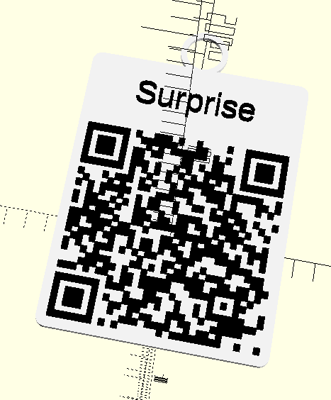

# QR badge

Simple scad to generate STL model of badge with qr code.

I designed it to make simple badge to help people connect to WIFI, but you can use it however you want!



## How to create STL with docker

1. Prepare svg file of your desired QR code

2. Put it in the same folder as ```main.scad``` and call it ```qr.svg```

2. Change all necessary parameters in ```main.scad``` file

3. Build docker image

```bash
docker build -t qr_badger .
```

4. Run given image

```bash
docker run --mount type=bind,source="$(pwd)"/,target=/data qr_badger
```

You can freely pass parameters to change the result of output model. For example:

```bash
docker run \
    -e LABEL='New label' \
    -e ADD_RING=false \
    -e QR_SIZE=150 \
    -e SVG_PATH='./qr.svg'
    --mount type=bind,source="$(pwd)"/,target=/data qr_badger
```

Or generate qr on the fly:

```bash
docker run \
    -e LABEL='My WIFI' \
    -e ADD_RING=false \
    -e QR_SIZE=150 \
    -e WIFI_SSID="My WIFI" \
    -e WIFI_PASSWORD="admin1" \
    --mount type=bind,source="$(pwd)"/,target=/data qr_badger
```

Full list of parameters:

- QR_SIZE

- QR_HEIGHT

- QR_OFFSET

- BORDER_RADIUS

- BORDER_RADIUS

- TEXT_HEIGHT

- PLATE_HEIGHT

- LABEL (to remove text just leave LABEL blank)

- TEXT_SIZE

- RING_RADIUS

- RING_THICKNESS

- ADD_RING

- ADD_BORDER

- WIFI_SSID

- WIFI_PASSWORD

- WIFI_AUTH_TYPE

- WIFI_HIDDEN

- SVG_PATH

## Features

- [x] Optional border

- [x] Optional ring at the top

- [x] Docker image to generate STL from given parameters

- [x] Docker-compose

- [x] Generate QR svg from parameters

- [x] Make text optional

- [ ] Optional holes for magnets

- [ ] Optional hole at the top

- [ ] Ability to add external fonts

- [ ] Preview badge from dockerfile
